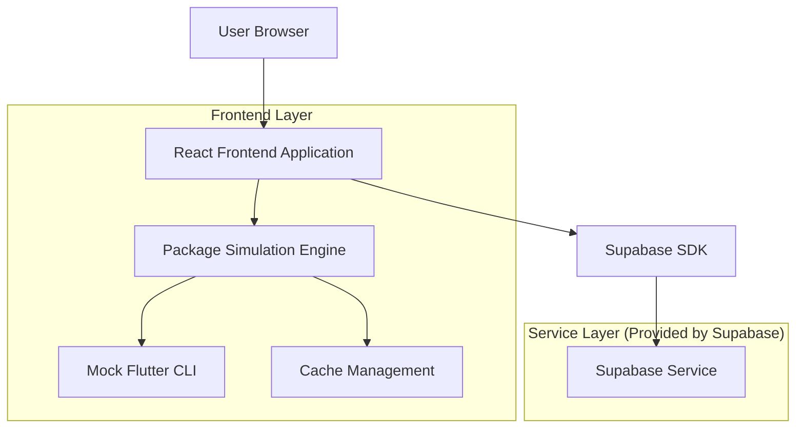
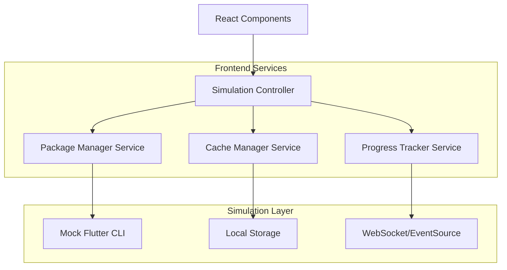
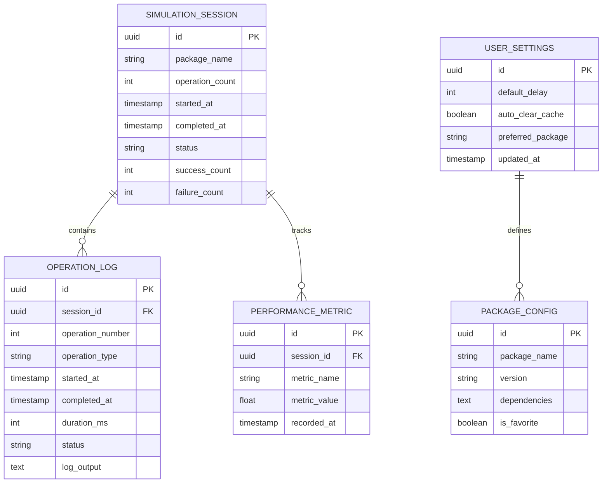

# Flutter Package Download Simulator - Technical Architecture Document

## 1. Architecture Design



## 2. Technology Description

* Frontend: React\@18 + TypeScript\@5 + Vite + TailwindCSS\@3

* Backend: Supabase (for operation history and user preferences)

* State Management: React Context + useReducer

* UI Components: Headless UI + Heroicons

* Charts: Chart.js + react-chartjs-2

* Simulation: Custom JavaScript workers for non-blocking operations

## 3. Route Definitions

| Route     | Purpose                                                  |
| --------- | -------------------------------------------------------- |
| /         | Main dashboard with input controls and operation display |
| /settings | Configuration page for package and simulation parameters |
| /history  | Historical logs and performance metrics                  |
| /about    | Information about the simulator and usage instructions   |

## 4. API Definitions

### 4.1 Core API

Simulation Control

```
POST /api/simulation/start
```

Request:

| Param Name  | Param Type | isRequired | Description                               |
| ----------- | ---------- | ---------- | ----------------------------------------- |
| packageName | string     | true       | Flutter package name to simulate          |
| count       | number     | true       | Number of operations to perform           |
| delay       | number     | false      | Delay between operations in ms            |
| clearCache  | boolean    | false      | Whether to clear cache between operations |

Response:

| Param Name | Param Type | Description                                   |
| ---------- | ---------- | --------------------------------------------- |
| sessionId  | string     | Unique identifier for this simulation session |
| status     | string     | Current status of the simulation              |

Example:

```json
{
  "packageName": "http",
  "count": 5,
  "delay": 1000,
  "clearCache": true
}
```

Operation History

```
GET /api/history
```

Response:

| Param Name  | Param Type | Description                          |
| ----------- | ---------- | ------------------------------------ |
| operations  | array      | List of historical operations        |
| totalCount  | number     | Total number of operations performed |
| averageTime | number     | Average time per operation           |

## 5. Server Architecture Diagram



## 6. Data Model

### 6.1 Data Model Definition



### 6.2 Data Definition Language

Simulation Session Table

```sql
-- Create simulation_sessions table
CREATE TABLE simulation_sessions (
    id UUID PRIMARY KEY DEFAULT gen_random_uuid(),
    package_name VARCHAR(255) NOT NULL,
    operation_count INTEGER NOT NULL,
    started_at TIMESTAMP WITH TIME ZONE DEFAULT NOW(),
    completed_at TIMESTAMP WITH TIME ZONE,
    status VARCHAR(50) DEFAULT 'pending' CHECK (status IN ('pending', 'running', 'completed', 'failed', 'cancelled')),
    success_count INTEGER DEFAULT 0,
    failure_count INTEGER DEFAULT 0,
    created_at TIMESTAMP WITH TIME ZONE DEFAULT NOW()
);

-- Create operation_logs table
CREATE TABLE operation_logs (
    id UUID PRIMARY KEY DEFAULT gen_random_uuid(),
    session_id UUID REFERENCES simulation_sessions(id) ON DELETE CASCADE,
    operation_number INTEGER NOT NULL,
    operation_type VARCHAR(50) NOT NULL,
    started_at TIMESTAMP WITH TIME ZONE DEFAULT NOW(),
    completed_at TIMESTAMP WITH TIME ZONE,
    duration_ms INTEGER,
    status VARCHAR(50) DEFAULT 'pending',
    log_output TEXT,
    created_at TIMESTAMP WITH TIME ZONE DEFAULT NOW()
);

-- Create performance_metrics table
CREATE TABLE performance_metrics (
    id UUID PRIMARY KEY DEFAULT gen_random_uuid(),
    session_id UUID REFERENCES simulation_sessions(id) ON DELETE CASCADE,
    metric_name VARCHAR(100) NOT NULL,
    metric_value DECIMAL(10,2) NOT NULL,
    recorded_at TIMESTAMP WITH TIME ZONE DEFAULT NOW()
);

-- Create user_settings table
CREATE TABLE user_settings (
    id UUID PRIMARY KEY DEFAULT gen_random_uuid(),
    default_delay INTEGER DEFAULT 1000,
    auto_clear_cache BOOLEAN DEFAULT true,
    preferred_package VARCHAR(255),
    updated_at TIMESTAMP WITH TIME ZONE DEFAULT NOW()
);

-- Create package_configs table
CREATE TABLE package_configs (
    id UUID PRIMARY KEY DEFAULT gen_random_uuid(),
    package_name VARCHAR(255) NOT NULL UNIQUE,
    version VARCHAR(50),
    dependencies TEXT,
    is_favorite BOOLEAN DEFAULT false,
    created_at TIMESTAMP WITH TIME ZONE DEFAULT NOW()
);

-- Create indexes
CREATE INDEX idx_operation_logs_session_id ON operation_logs(session_id);
CREATE INDEX idx_operation_logs_created_at ON operation_logs(created_at DESC);
CREATE INDEX idx_performance_metrics_session_id ON performance_metrics(session_id);
CREATE INDEX idx_simulation_sessions_created_at ON simulation_sessions(created_at DESC);

-- Grant permissions
GRANT SELECT ON simulation_sessions TO anon;
GRANT ALL PRIVILEGES ON simulation_sessions TO authenticated;
GRANT SELECT ON operation_logs TO anon;
GRANT ALL PRIVILEGES ON operation_logs TO authenticated;
GRANT SELECT ON performance_metrics TO anon;
GRANT ALL PRIVILEGES ON performance_metrics TO authenticated;
GRANT ALL PRIVILEGES ON user_settings TO authenticated;
GRANT ALL PRIVILEGES ON package_configs TO authenticated;

-- Insert initial data
INSERT INTO package_configs (package_name, version, is_favorite) VALUES
('http', '^1.1.0', true),
('dio', '^5.3.0', true),
('shared_preferences', '^2.2.0', false),
('provider', '^6.0.0', false),
('flutter_bloc', '^8.1.0', false);
```

