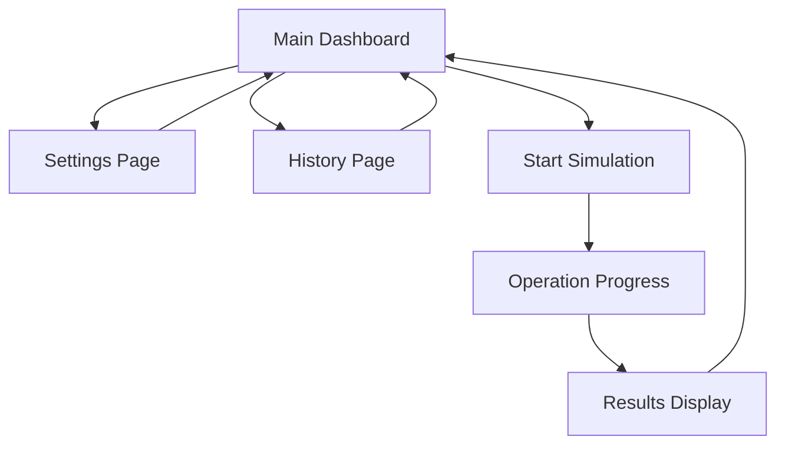

# Flutter Package Download Simulator - Product Requirements Document

## 1. Product Overview
A web application that simulates Flutter package download operations, allowing users to repeatedly execute pub get commands with cache clearing for testing and demonstration purposes.
- Helps developers test package download scenarios and simulate network conditions for Flutter package management workflows.
- Target users include Flutter developers, DevOps engineers, and QA testers who need to validate package download behaviors.

## 2. Core Features

### 2.1 User Roles
No role distinction required - single user application.

### 2.2 Feature Module
Our Flutter package simulator consists of the following main pages:
1. **Main Dashboard**: input controls, operation status, progress tracking, results display.
2. **Settings Page**: package configuration, simulation parameters, cache settings.
3. **History Page**: operation logs, previous runs, performance metrics.

### 2.3 Page Details

| Page Name | Module Name | Feature description |
|-----------|-------------|---------------------|
| Main Dashboard | Input Controls | Enter count number, select target package, start/stop operation buttons |
| Main Dashboard | Progress Tracker | Real-time progress bar, current operation status, elapsed time display |
| Main Dashboard | Operation Display | Live log output, success/failure indicators, operation counter |
| Main Dashboard | Results Summary | Total operations completed, success rate, average time per operation |
| Settings Page | Package Configuration | Select Flutter package name, version specification, dependency options |
| Settings Page | Simulation Parameters | Delay between operations, timeout settings, retry configuration |
| Settings Page | Cache Management | Cache location settings, clear cache options, cache size display |
| History Page | Operation Logs | Detailed logs of previous runs, timestamps, operation details |
| History Page | Performance Metrics | Charts showing operation times, success rates, historical trends |

## 3. Core Process

**Main User Flow:**
1. User opens the main dashboard
2. User enters the desired count of operations
3. User selects or configures the target Flutter package
4. User clicks "Start Simulation" button
5. System begins the simulation loop:
   - Execute pub get for the specified package
   - Display progress and status
   - Clear package cache
   - Repeat for the specified count
6. User can monitor real-time progress and logs
7. User can stop the operation at any time
8. System displays final results and statistics

## 4. User Interface Design

### 4.1 Design Style
- Primary colors: Flutter blue (#0175C2) and white (#FFFFFF)
- Secondary colors: Success green (#4CAF50), warning orange (#FF9800), error red (#F44336)
- Button style: Rounded corners with subtle shadows, Material Design inspired
- Font: Roboto for headings, Open Sans for body text, sizes 14px-24px
- Layout style: Card-based design with clean spacing, top navigation bar
- Icons: Material Design icons, consistent with Flutter ecosystem

### 4.2 Page Design Overview

| Page Name | Module Name | UI Elements |
|-----------|-------------|-------------|
| Main Dashboard | Input Controls | Large number input field, dropdown for package selection, prominent blue "Start" button |
| Main Dashboard | Progress Tracker | Animated progress bar with percentage, status badges, timer display |
| Main Dashboard | Operation Display | Terminal-style log area with dark background, scrollable content, syntax highlighting |
| Main Dashboard | Results Summary | Statistics cards with icons, success/failure counters, performance metrics |
| Settings Page | Package Configuration | Form inputs with validation, package search autocomplete, version selector |
| Settings Page | Simulation Parameters | Slider controls for timing, toggle switches for options, numeric inputs |
| History Page | Operation Logs | Filterable table with timestamps, expandable row details, export options |
| History Page | Performance Metrics | Interactive charts using Chart.js, time-series graphs, comparison views |

### 4.3 Responsiveness
Desktop-first design with mobile-adaptive layout. Touch interaction optimization for mobile devices, with larger touch targets and swipe gestures for navigation.